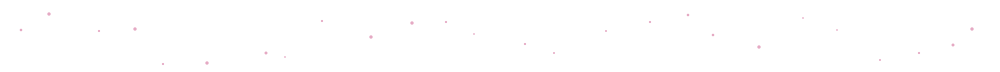

## Chaeyeon Lee

  
  
  

### Recent work

- **Medical RAG** · BM25 + FAISS + bge-reranker over 55k documents. BERTScore +0.16.
- **Korean noise restoration** · KoELECTRA classifies the corruption, KoBART restores it. BERTScore 0.9812.
- **FinView** · Numeric analysis (XGBoost, KMeans) kept separate from the LLM narrative, so the financial report cannot invent figures.
- **Konglish corrector** · LoRA and 4-bit quantization with FAISS memory. 0.47s on device.
- **CT to MRI** · CycleGAN on unpaired cross-modality translation. SSIM 0.82 to 0.88.

 

<picture>
  <source media="(prefers-color-scheme: dark)" srcset="https://raw.githubusercontent.com/cofldus/cofldus/output/github-snake-dark.svg" />
  <source media="(prefers-color-scheme: light)" srcset="https://raw.githubusercontent.com/cofldus/cofldus/output/github-snake.svg" />
  
</picture>
