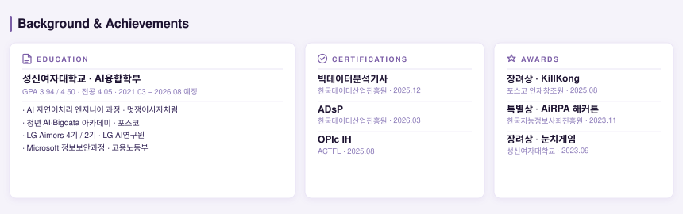

  &nbsp;&nbsp;
  &nbsp;&nbsp;
  &nbsp;&nbsp;
  

 

## About

AI/NLP 엔지니어로서 데이터 설계부터 모델링, API 서빙, 운영 최적화까지 E2E로 수행합니다.
LLM 파인튜닝·RAG 파이프라인 설계, 비정형 문서 처리·구조화, 패턴인식 기반 분류·추출이 강점이며
정확도뿐 아니라 지연시간·비용·운영 안정성까지 함께 최적화하는 것을 지향합니다.

 

## Featured Metrics

| 프로젝트 | 성과 |
|---|---|
| LLM 경량화 파이프라인 | 모델 경량화 **76%** · 응답속도 **61% 개선** · FAISS 검색 **0.1s** |
| 금융 문서 AI | 리포트 생성 **5분 → 30초** · GPT 비용 **70% 절감** · 오류율 **80% → 15%** |
| CT→MRI 패턴인식 | SSIM **0.82 → 0.88** · PSNR 변동률 **18% → 5%** |
| 하이브리드 RAG | BERTScore **+0.16↑** · Accuracy **+0.04↑** · 코퍼스 **5.5만건** |

 

## Selected Projects

### LLM 파인튜닝 · 온디바이스 경량화 에이전트
LoRA 파인튜닝 + 4-bit 양자화 + FAISS 하이브리드 RAG로 설계한 온디바이스 LLM 경량화 파이프라인.
- 모델 경량화 **76%** (14GB → 3.0GB), 응답속도 **61% 개선** (2.3s → 0.47s)
- FAISS+BM25 하이브리드 RAG, 개인화 메모리 아키텍처 구현
- **역할/기술:** RAG Retriever/Inference 분리 설계, LoRA 파인튜닝, 팀 리드 · Qwen2.5, FAISS, FastAPI, Docker, K8s
- ★ 포스코 인재창조원 장려상
- [Repo](https://github.com/cofldus/killkong_konglish-corrector) · [Portfolio](https://cofldus.github.io/)

### 금융 문서 AI · 수치-언어 역할 분리 아키텍처
재무제표·뉴스·시장데이터를 통합하고 계산 모듈과 언어 생성을 분리한 AI 재무 분석 시스템.
- 리포트 생성 **5분 → 30초**, GPT 비용 **70% 절감**
- 계산 모듈과 언어 생성 분리로 GPT 환각 문제 구조적 해결
- **역할/기술:** GPT-4 프롬프트 설계, XGBoost 분류, DART API 파이프라인 · GPT-4, XGBoost, SHAP, Flask, Redis
- [Repo](https://github.com/cofldus/finview_generative-ai-report) · [Portfolio](https://cofldus.github.io/)

### 위치 기반 혼잡도 예측 · FP-Growth 패턴 마이닝
공공데이터와 GPS 기반의 이동 패턴 마이닝 및 대체 공간 추천 서비스.
- 실시간 밀집도 예측 정확도 **84%**, 혼잡 회피 성공률 **87%**
- **역할/기술:** 이동패턴 마이닝, 혼잡 예측, 모바일 지도 UX/백엔드 · FP-Growth, React Native, Flask, SQLite
- ★ 성신여자대학교 IT경진대회 장려상
- [Repo](https://github.com/cofldus/hunchgame_density-predict-service) · [Portfolio](https://cofldus.github.io/)

### 멀티 에이전트 상권 시뮬레이션 · 가상 고객 의사결정 검증
AI Agent 기반 가상 고객 시뮬레이션으로 상권 전략을 사전 검증하는 점주 의사결정 플랫폼.
- 변경안 적용 결과 예측 구조 구현으로 과거 요약형 분석 한계 극복
- `진단 → 시뮬레이션 → 결과 리포트` 파이프라인으로 실행 전략 제공
- **역할/기술:** 데이터 전처리, AI Agent 페르소나·행동 로직 설계, 시뮬레이션 검증 · Gemma, EXAONE, GPT-4.1
- [Repo](https://github.com/cofldus/lovelop_commerce-agent-simulation) · [Portfolio](https://cofldus.github.io/)

 

## More Projects
- [CT→MRI 교차-모달리티 변환 · CycleGAN 패턴인식](https://github.com/cofldus/medical_image_translation)
- [한국어 텍스트 복원 AI · 분기형 NLP 파이프라인](https://github.com/cofldus/korean-noise-restoration)
- [하이브리드 RAG · 전문 도메인 의학 AI](https://github.com/cofldus/medical-chatbot_aegis-bio-sentinels)
- [비정형 문서 자동화 · RPA+NLP 파이프라인 (+ more → Portfolio)](https://cofldus.github.io/)
- [전체 레포 목록](https://github.com/cofldus?tab=repositories)

 

## Tech Stack
`Python` `PyTorch` `HuggingFace` `LangChain` `FAISS` `FastAPI` `Flask` `Redis` `SQLite` `Docker` `Kubernetes` `React Native` `KoBART` `KoELECTRA` `Pandas` `scikit-learn`

## Background & Achievements

  

 

## GitHub Stats

  
  
   
  
   
  

 

## Contact
[GitHub](https://github.com/cofldus) · [LinkedIn](https://www.linkedin.com/in/chaeyeon-lee-113698274) · [Portfolio](https://cofldus.github.io/) · [Resume](https://github.com/cofldus/cofldus/blob/main/assets/resume_leechaeyeon.pdf) · [Email](mailto:lcyicy1717@gmail.com)

## Extras
[hits](https://myhits.vercel.app/api/hit/https%3A%2F%2Fgithub.com%2Fcofldus%2Fcofldus?color=7C3AED&label=hits&size=small) · [solved.ac](https://solved.ac/lcylcy3816)
